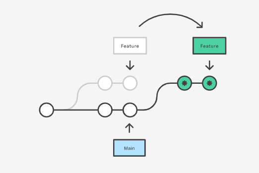
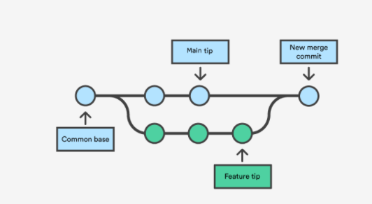

# Git

## Что такое?
Git это система для хранения кода и управления версиями. Можно почитать [книгу](https://git-scm.com/book/ru/v2) о том, что это такое и как оно работает.

Не путаейте Git с сайтами и серверами, которые хостят Git репозитории. Примеры таких сайтов [github.com](https://github.com), [bitbucket.com](https://bitbucket.com). Обычно эти сайты предоставляют дополнительную функциональность вроде code review, CI/CD, трекинг задач.

## Как пользоваться?

### [Установка Git](https://git-scm.com/book/ru/v2/%D0%92%D0%B2%D0%B5%D0%B4%D0%B5%D0%BD%D0%B8%D0%B5-%D0%A3%D1%81%D1%82%D0%B0%D0%BD%D0%BE%D0%B2%D0%BA%D0%B0-Git)

Мы будем пользоваться Git при помощи командной строки. Это самый простой способ и при таком способе использования вы получаете всю доступную функциональность. Существуют также приложения с графическим интерфейсом пользователя, но в индустрии инженеры используют командный интерфейс.

Вот список основных команд, которые вам потребуются:

```
git clone
git config
git fetch
git rebase
git merge
git add
git status
git commit
git push
git reset
git diff
git log
git remote
git branch
git checkout
```

### Клонирование репозитория
Допустим уже кто-то создал репозиторий и расположил его на одном из серверов, например на github.com.

Первое, что нужно уметь делать - клонировать репозиторий на рабочую машину (создавать локальную копию репозитория). С ней вы и будете все время работать. Git умеет взаимодействовать с серверами по одному из двух протоколов: `SSH` и `HTTPS`.

#### SSH
Чтобы взаимодействовать с сервером по протоколу SSH, нужно чтобы сервер мог вас аутентифицировать. Для этого обычно используется асимметричная криптография или криптография с публичными ключами.

- Cгенерируйте пару ключей (секретный и открытый) при помощи программы PuTTYgen или ssh-keygen.
- Загрузите открытый ключ на сервер. В github есть специальная страница (Settings -> SSH and GPG keys -> New SSH key)
- Склонируйте репозиторий при помощи команды
    ```
    git clone git@github.com:iesdubna2023/docs.git
    ```

#### HTTPS
Репозитрии могут быть публичными и приватными. Если репозиторий публичный, то вам даже не нужен аккаунт на сервере. Если репозиторий приватный, то вам нужем аккаунт на сервере и ваш аккаунт должен иметь права доступа к нужному вам приватному репозиторию.

- Склонируйте репозиторий при помощи команды
    ```
    git clone https://github.com/iesdubna2023/docs.git
    ```

Обратите внимание, что ссылки на один и тот же репозиторий немного разные. Так git узнает, какой протокол необходимо использовать.

После того, как вы склонировали репозиторий, у вас в вашей текущей директории появится директория `docs`. Это и есть локальная копия репозитория. Все остальные команды `git <subcommand>` нужно запускать внутри вашей локальной копии. Репозиторий - это просто директория с файлами. В ней всегда есть поддиректория `.git` в которой git хранит необходимые ему данные.


## git config
Перед тем как вы будете делать любые изменения и записывать их, очень важно сделать некоторые минимальные настройки, чтобы в истории коммитов отображалось ваше имя и e-mail. Это важно, чтобы тот, кто будет смотреть исходный код вашей программы, понимал кто сделал те или иные изменения.

```
git config user.name "Name Surname"
git config user.email "username@domain.name"
```

## git log
Эту команду вы можете использовать, чтобы посмотреть историю коммитов в ветке (по умолчанию в текущей ветке).

## git status
Используя ваш текстовый редактор, сделайте необходимые изменения (создайте/удалите файлы, отредактируйте существующие файлы).

После этого используйте команду `git status` чтобы увидеть измененные файлы или файлы, которые вы пока не добавили в индекс репозитория.

Измененные, новые или удаленные файлы будут отображаться подсвеченными определенным цветом (зависит от настроек и возможностей вашего терминала).

## git diff
Чтобы посмотреть сделанные изменения, можно использовать команду
```
git diff
```

## git add
Эту команду используйте для того, чтобы добавить ваши изменения в индекс (по сути вы можете сказать git-у какие из ваших изменений вы хотите закоммитить).

Этой командой пользуйтесь аккуратно и добавляйте только НЕОБХОДИМЫЕ изменения. Опыт показывает, что некоторые люди создают всяких временных файлов и потом просто используют `git add .` которая добавляет в индекс все файлы в том числе и мусорные. Коммитить нужно только то, что НЕОБХОДИМО.


## git commit
Теперь добавленный в индекс изменения можно закоммитить. Делается это вот такой командой
```
git commit -m "здесь должен быть комментарий к коммиту"
```

Хороший комментарий кратко описывает сделанные изменения и мотивацию для них.

## git push
Для того, чтобы загрузить сделанные изменения на сервер
```
git push origin main:new_branch_name
```

Эта команда создаст на сервере ветку с именем `new_branch_name`. Ee потом можно будет использовать для создания "пулл реквеста" (pull request). Пулл реквест это функциональность Github, а не Git. Pull requests создаются из ветки в ветку. Фактически это просьба смержить (слить) изменения сделанные в одной ветке в другую ветку.

## git fetch
Когда вы клонируете репозиторий, то у вас создается локальная копия репозитория на момент клонирования. Пока вы работаете над вашими изменениями, репозиторий мог поменять свое состояние, ваши коллеги могли добавить свои коммиты.

Для того чтобы обновить состояние вашего репозитория используйте команду `git fetch`. С ее помощью вы можете стянуть изменения с сервера. Но эти изменения будут видны только в так называемых `remote` ветках (git различает серверные `remote` ветки и локальные). Эти изменения в ваши локальные ветки можно затянуть двумя способами.

- `git rebase`
- `git merge`

## git rebase
Используйте эту команду, чтобы поменять базовый коммит вашей ветки


`git rebase` перезапишет все коммиты в вашей бранче новыми коммитами.

## git merge
Используйте эту команду, чтобы затянуть коммиты из какой то ветки в текущую ветку


`git merge` создаст дополнительный коммит с двумя базовыми коммитами.

## git remote
При клонировании репозитория с сервера, URL к этому удаленному репозиторию будет иметь псевдоним `origin`.

Посмотреть список удаленных репозиториев
```
git remote -v
```

Добавить новый репозиторий
```
git remote add <remote_name> <remote_url>
```

Когда вы пушаете изменения на сервер, вы можете выбрать любой из удаленных репозиториев (по умолчанию `origin`)
```
git push <remote_name> <local branch>:<remote branch>
```

## git branch
Эту команду можно использовать, чтобы посмотреть список имеющихся веток.

## git checkout
Эта команда используется, чтобы сменить текущую ветку (или создать новую ветку).

Сменить ветку
```
git checkout branch_name
```

Создать новую ветку
```
git checkout -b new_branch_name
```

# New section
